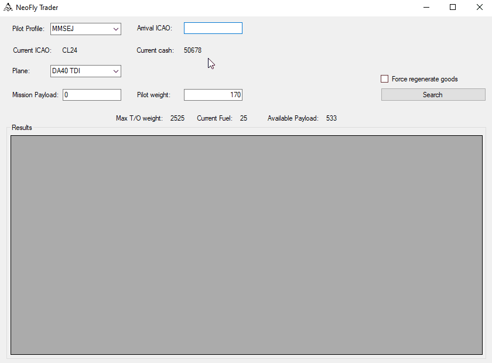

# NeoFly-Trader
Auto Trading tool for NeoFly

## How to use
* First ensure the path to your NeoFlyDatabase is correct in the NeoFlyTrader.ini file
* Basically you just have to launch the software after your NeoFly and enter your destination ICAO
* If you fly a main mission you can put its payload inside the Mission Payload field and you're ready to know what to choose to fill your remaining empty payload
* You can choose which plane you're going to fly. It will auto update all the associated weights

## Goods Market generation
* If your departure or destination ICAO don't contains any goods. The software will create them.
* You can force regenerating goods by checking the "Force regenerate goods" box
* The goods generation respect several rules to follow NeoFly goods generation
	* It respects the probability of a specific good type appearance
	* Its price can be in a range of -30% to +30% to the average good price
	* Its quantity can be in a range of -30% to +30% to the average goods quantity in airports
	* Airports can randomly search or sell the good

## Issue
Before using you need to have at least some goods generated at an airport by NeoFly. You can go into NeoFly any airport market and refresh goods to force this generation

## License
This software is licensed under Apach license 2.0

## If you like my work, I like coffee :)

